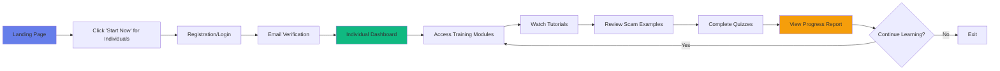
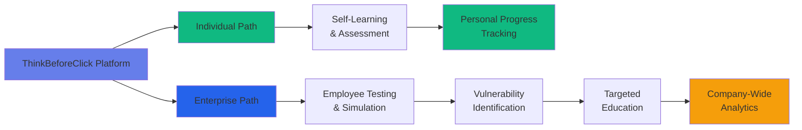

# ThinkBeforeClick User Journey

## Individual User Journey (Free)

## Enterprise User Journey (Paid)

```mermaid
graph LR
    A[Landing Page] --> B[Select 'Enterprise']
    B --> C[Enter Verification Code]
    C --> D[Registration Form]
    D --> E[Create Company ID + Org Type]
    E --> F[Email Verification]
    F --> G[Admin Login with Company ID]
    G --> H[Enterprise Dashboard]
    
    H --> I[Add Employees]
    I --> J[Select Phishing Templates]
    J --> K[Send Simulation Emails]
    K --> L[Real-Time Tracking]
    
    L --> M{Employee Opens Email?}
    M -->|Yes| N[Track Open Event]
    M -->|No| O[Email Not Opened]
    
    N --> P{Employee Clicks Link?}
    P -->|Yes| Q[Track Click Event]
    P -->|No| R[No Click Recorded]
    
    Q --> S[Redirect to Education Page]
    S --> T[Employee Learns Red Flags]
    
    L --> U[Generate Analytics Report]
    U --> V[View Metrics Dashboard]
    V --> W[- Open Rates<br>- Click Rates<br>- Employee Rankings<br>- Vulnerability Analysis]
    
    W --> X[Download Historical Reports]
    X --> Y{Run More Simulations?}
    Y -->|Yes| I
    Y -->|No| Z[Exit]
    
    style A fill:#667eea
    style H fill:#2563EB
    style U fill:#F59E0B
    style S fill:#10B981
    style W fill:#F59E0B
```

## Comparison Flow

## Key Features by User Type

### Individual (FREE)
- ✅ Interactive training modules
- ✅ Adaptive quizzes
- ✅ Personal progress tracking
- ✅ Real-world scam examples
- ✅ Self-paced learning

### Enterprise (PAID)
- ✅ 10 phishing email templates
- ✅ Employee management system
- ✅ Real-time tracking (opens & clicks)
- ✅ Instant educational feedback
- ✅ Comprehensive analytics dashboard
- ✅ Vulnerability rankings
- ✅ Historical report downloads
- ✅ Template performance metrics

